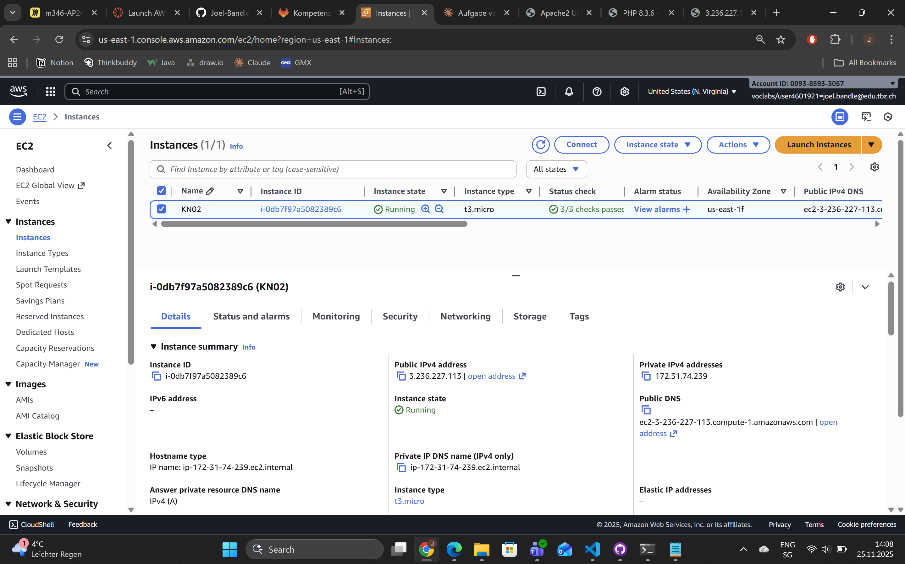
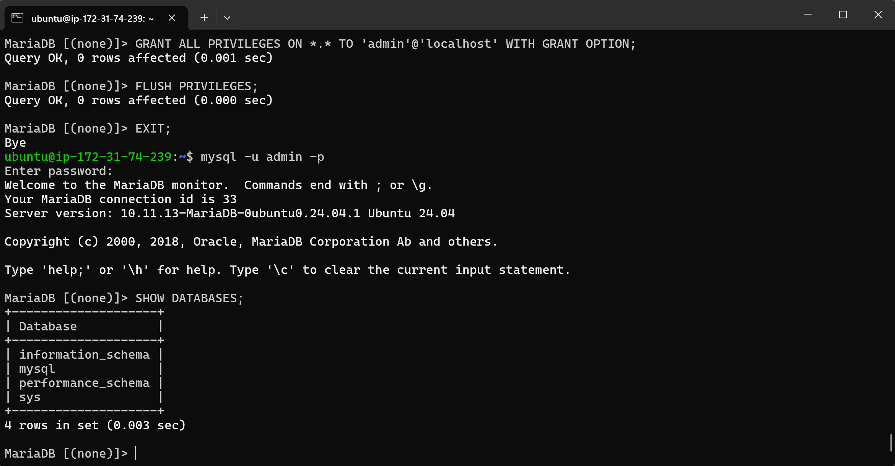
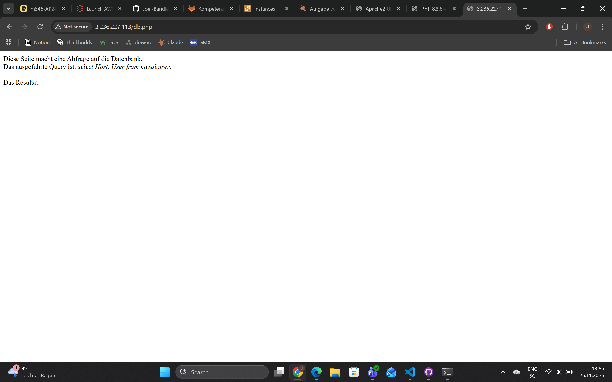
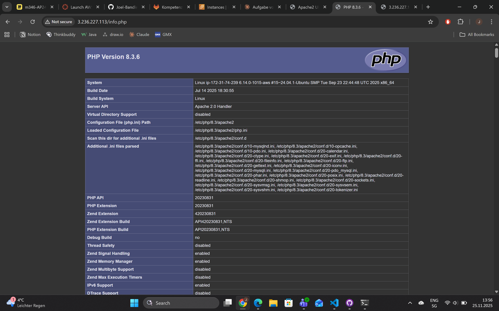
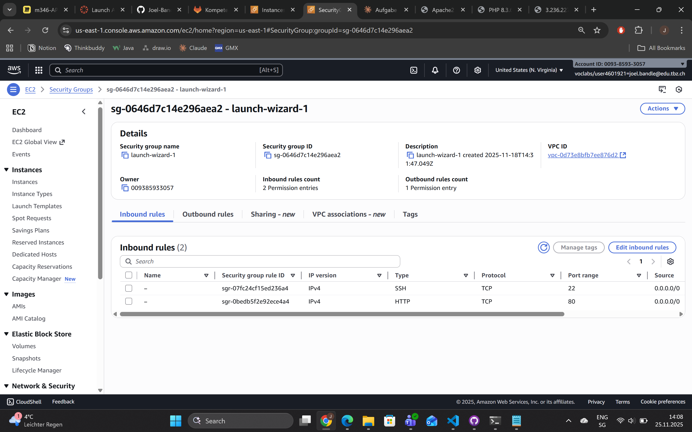
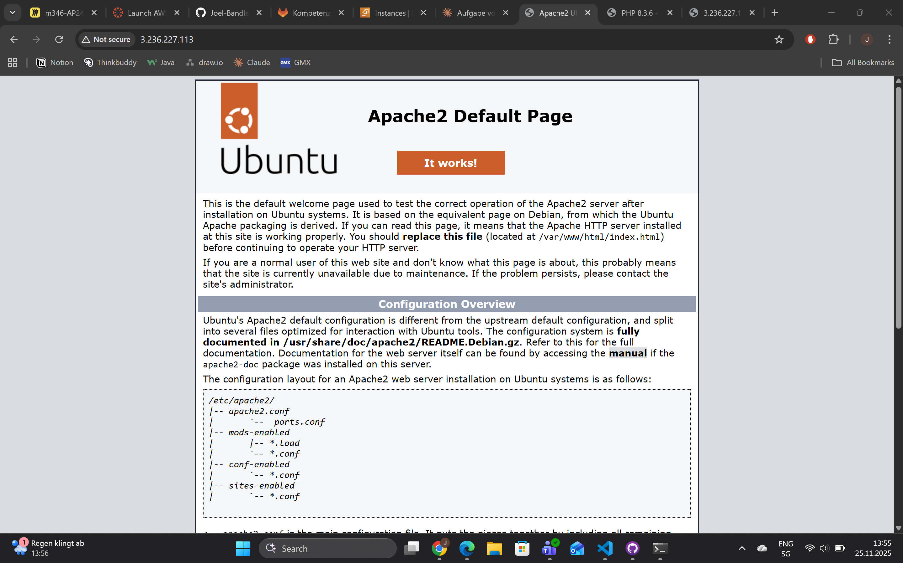

# KN03

## Aufgabe A:

### Durchgeführte Schritte

#### 1. System aktualisiert
```bash
sudo apt update
```

#### 2. Apache2 Webserver installiert
```bash
sudo apt install apache2
sudo systemctl restart apache2
```

#### 3. PHP installiert
```bash
sudo apt install php
sudo apt install libapache2-mod-php
```

#### 4. MariaDB Datenbankserver installiert
```bash
sudo apt install mariadb-server
sudo apt install php-mysql
sudo systemctl restart mariadb.service
```

#### 5. Git-Repository geklont
```bash
cd ~
git clone https://gitlab.com/ch-tbz-it/Stud/m346/m346scripts.git
```

#### 6. PHP-Dateien kopiert
```bash
sudo cp ./m346scripts/KN03/*.php /var/www/html/
```

#### 7. MySQL-Benutzer erstellt
```sql
CREATE USER 'admin'@'localhost' IDENTIFIED BY 'Passwort';
GRANT ALL PRIVILEGES ON *.* TO 'admin'@'localhost' WITH GRANT OPTION;
FLUSH PRIVILEGES;
```

#### 8. Firewall konfiguriert
In der AWS Security Group wurden folgende Inbound Rules hinzugefügt:
- **Port 22 (SSH)** - TCP - Source: 0.0.0.0/0
- **Port 80 (HTTP)** - TCP - Source: 0.0.0.0/0

### Getestete URLs
- `http://3.236.227.113/` - Apache Standard-Seite
- `http://3.236.227.113/info.php` - PHP-Informationen
- `http://3.236.227.113/db.php` - Datenbankverbindung

### SQL-Abfrage Erklärung
**Verwendeter Befehl:** `SHOW DATABASES;`

Dieser SQL-Befehl zeigt alle verfügbaren Datenbanken auf dem MariaDB-Server an. Die Ausgabe listet die Standard-Datenbanken (information_schema, mysql, performance_schema) auf. Mit diesem Befehl kann überprüft werden, ob die Datenbankverbindung funktioniert und welche Datenbanken zur Verfügung stehen.

## Screenshots





