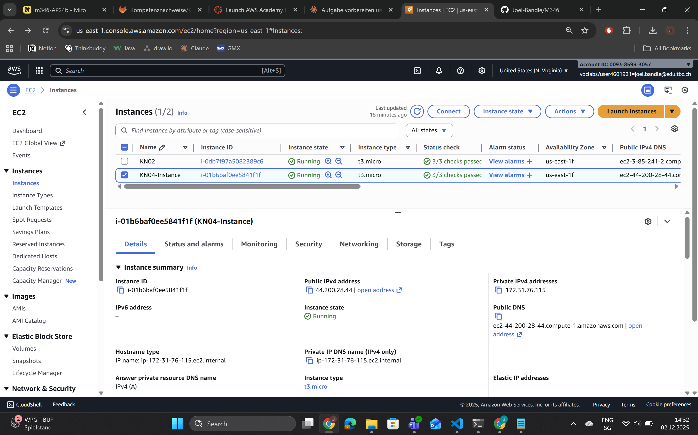
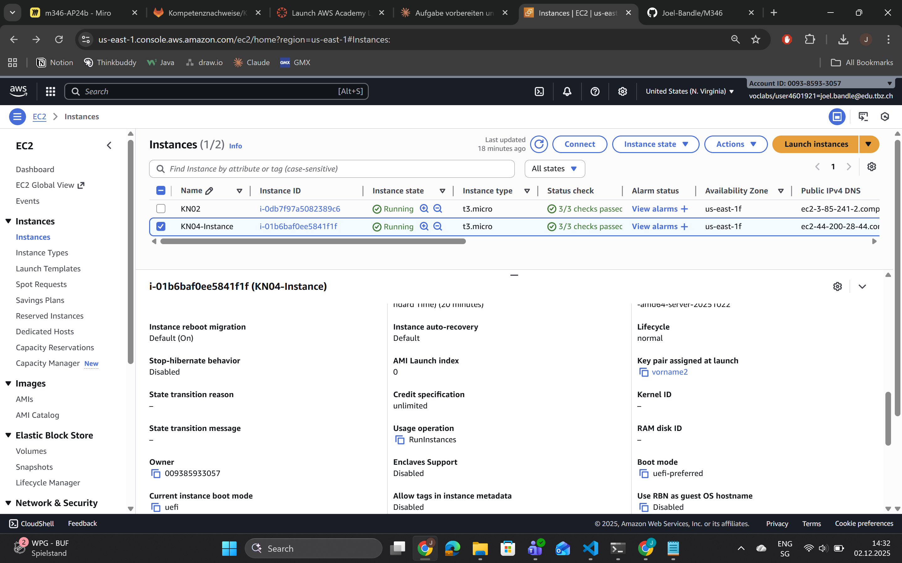
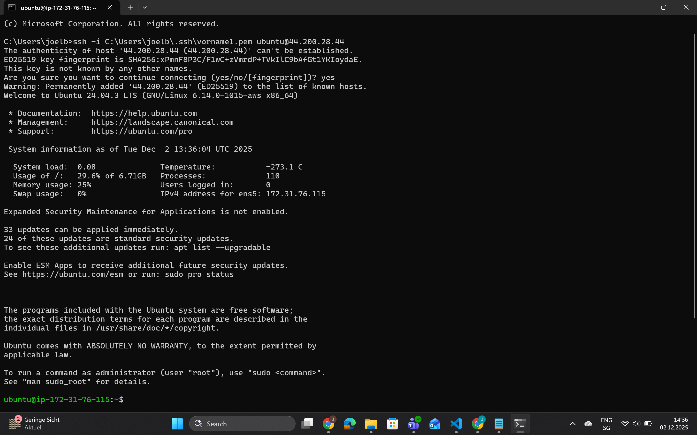
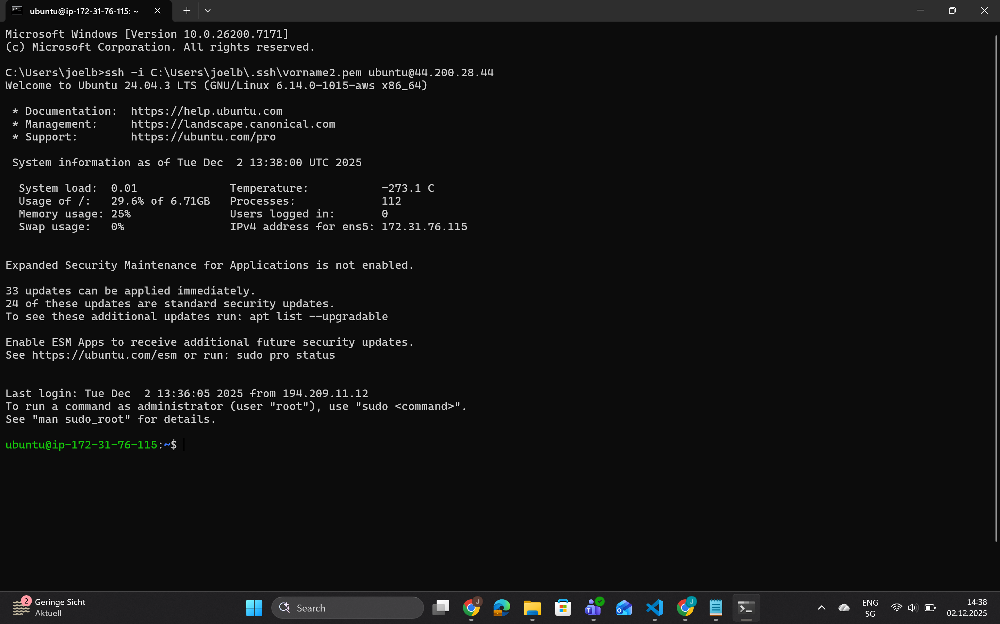
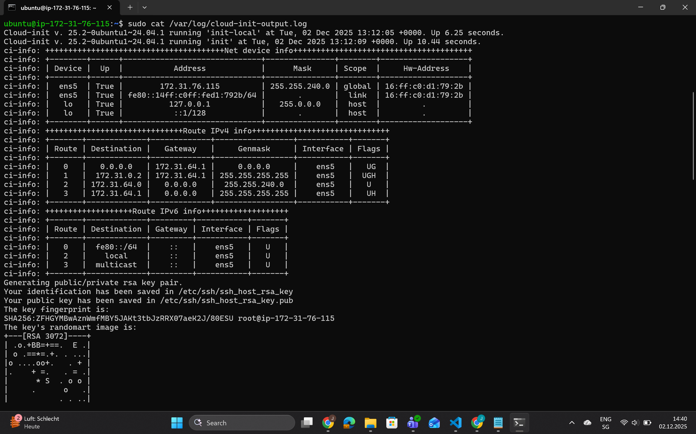
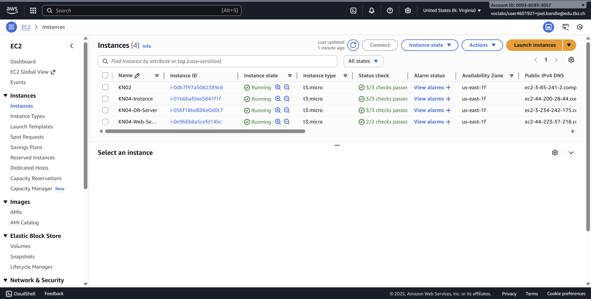
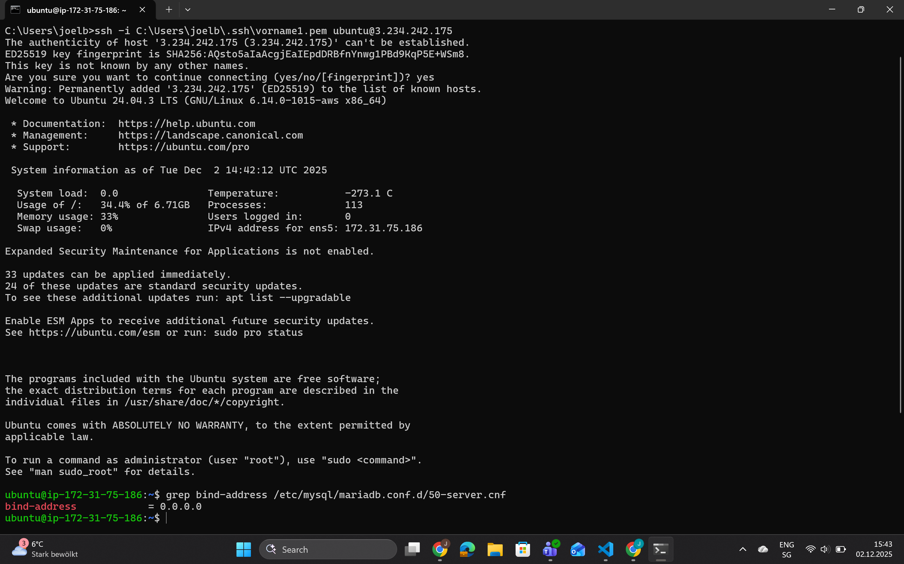
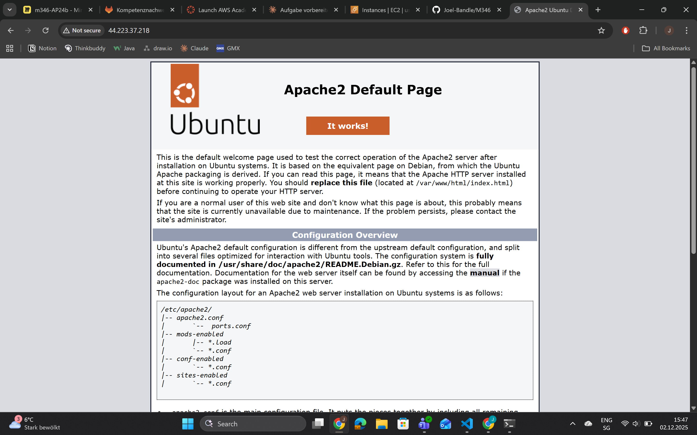
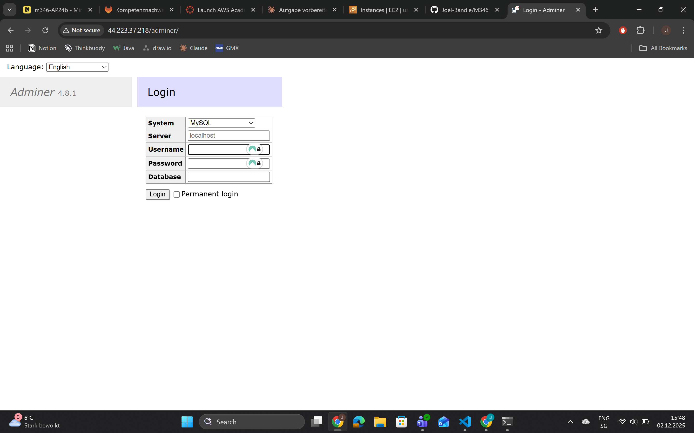
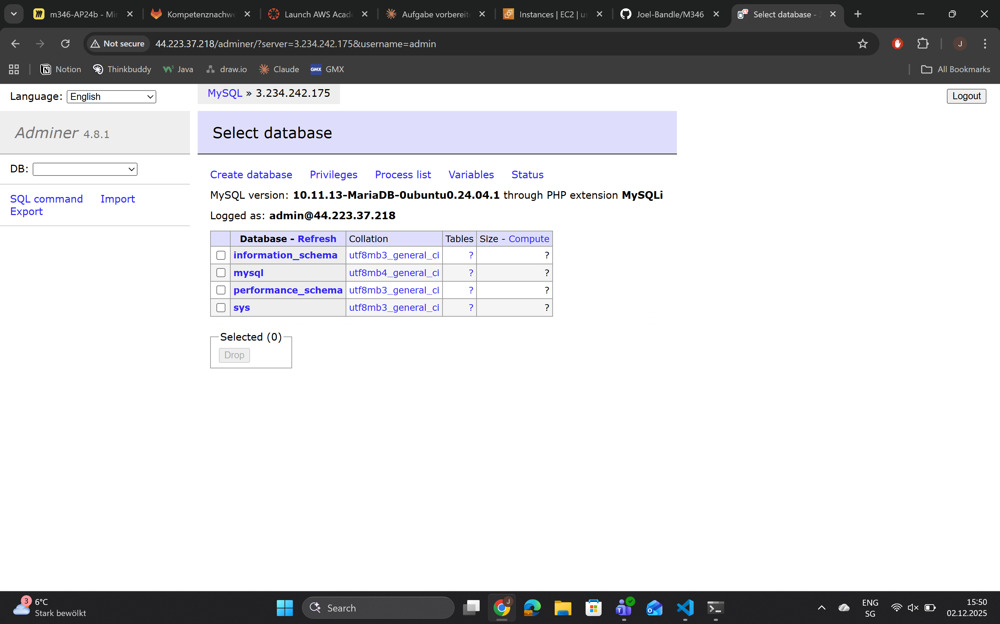

# KN04

## Aufgabe A

### Was ist Cloud-init?

Cloud-init ist ein Automatisierungs-Tool für Cloud-Instanzen. Es konfiguriert eine VM beim ersten Start automatisch, ohne dass manuelle Eingriffe nötig sind.

### Cloud-init.yaml

#### Zeile 1: Header
```yaml
#cloud-config
```
- **Bedeutung:** Markierung, dass dies eine Cloud-init Konfigurationsdatei ist
- **Zweck:** Cloud-init erkennt damit, dass die Datei verarbeitet werden soll

---

#### Zeile 2-3: Benutzer-Konfiguration
```yaml
users:
  - name: ubuntu
```
- **Bedeutung:** Beginn der Benutzer-Konfiguration
- **Zweck:** Erstellt einen Benutzer mit dem Namen "ubuntu"
- **Hinweis:** Dies ist der Standard-Benutzername für Ubuntu-Instanzen

---

#### Zeile 4: Gruppen-Zuordnung
```yaml
    groups: [users, admin]
```
- **Bedeutung:** Fügt den Benutzer zu mehreren Gruppen hinzu
- **groups:**
  - `users` = Standard-Benutzergruppe
  - `admin` = Administrative Gruppe (erlaubt Verwendung von sudo)
- **Zweck:** Gibt dem Benutzer administrative Rechte

---

#### Zeile 5: Shell festlegen
```yaml
    shell: /bin/bash
```
- **Bedeutung:** Setzt die Standard-Shell auf Bash
- **Zweck:** Definiert, welche Kommandozeile beim Login gestartet wird
- **Alternative:** Könnte auch `/bin/zsh` oder andere Shells sein

---

#### Zeile 6: Sudo-Rechte
```yaml
    sudo: ALL=(ALL) NOPASSWD:ALL
```
- **Bedeutung:** Konfiguriert sudo-Berechtigungen für den Benutzer
- **Aufschlüsselung:**
  - `ALL=(ALL)` = Kann alle Befehle als alle Benutzer ausführen
  - `NOPASSWD:ALL` = Kein Passwort erforderlich für sudo-Befehle
- **Zweck:** Benutzer kann administrative Aufgaben ohne Passwort-Eingabe ausführen

---

#### Zeile 7-8: SSH-Schlüssel
```yaml
    ssh_authorized_keys:
      - ssh-rsa AAAAB3NzaC1yc2EAAAADAQABAAABAQC0WGP1EZykEtv5Y6C9nMiPFW3U3DmZNzkKF0SnEu6uozEHh4jLZzPNHSrfFTuQ2GnRDSt+XbOtLdc]26+iPNiFoFha42aCIzYjt6V8Z+...
```
- **Bedeutung:** Definiert autorisierte SSH-Schlüssel für den Benutzer
- **Zweck:** Ermöglicht passwortloses SSH-Login mit privatem Schlüssel
- **Funktionsweise:**
  - Der öffentliche SSH-Schlüssel wird in `~/.ssh/authorized_keys` gespeichert
  - Nur wer den passenden privaten Schlüssel besitzt, kann sich einloggen
- **Vorteil:** Sicherer als Passwort-Authentifizierung

---

#### Zeile 9: SSH-Passwort-Authentifizierung
```yaml
ssh_pwauth: false
```
- **Bedeutung:** Deaktiviert Passwort-Authentifizierung für SSH
- **Zweck:** Erhöht die Sicherheit
- **Auswirkung:** Login ist nur mit SSH-Keys möglich, nicht mit Passwort
- **Vorteil:** Schützt vor Brute-Force-Angriffen

---

#### Zeile 10: Root-Login
```yaml
disable_root: false
```
- **Bedeutung:** Root-Login ist **nicht** deaktiviert
- **Auswirkung:** Root-Benutzer kann sich am System anmelden
- **Wert:** `false` = Root-Login ist erlaubt

---

#### Zeile 11: Paket-Updates
```yaml
package_update: true
```
- **Bedeutung:** Aktualisiert die Paketlisten beim ersten Start
- **Entspricht dem Befehl:** `sudo apt update`
- **Zweck:** Stellt sicher, dass die neuesten Paketversionen verfügbar sind
- **Wichtig:** Führt kein Upgrade durch, sondern nur ein Update der Listen

---

#### Zeile 12-14: Paket-Installation
```yaml
packages:
  - curl
  - wget
```
- **Bedeutung:** Liste der Pakete, die automatisch installiert werden
- **Installierte Pakete:**
  - `curl` = Tool zum Herunterladen von Dateien über HTTP/HTTPS/FTP
  - `wget` = Alternatives Tool zum Herunterladen von Dateien
- **Entspricht den Befehlen:**
```bash
  sudo apt install curl
  sudo apt install wget
```

---

## Aufgabe B







## Aufgabe C

Siehe Datei: cloud-init-template.yaml

## Aufgabe D

Siehe Datei: cloud-init-db.yaml / cloud-init-web.yaml





