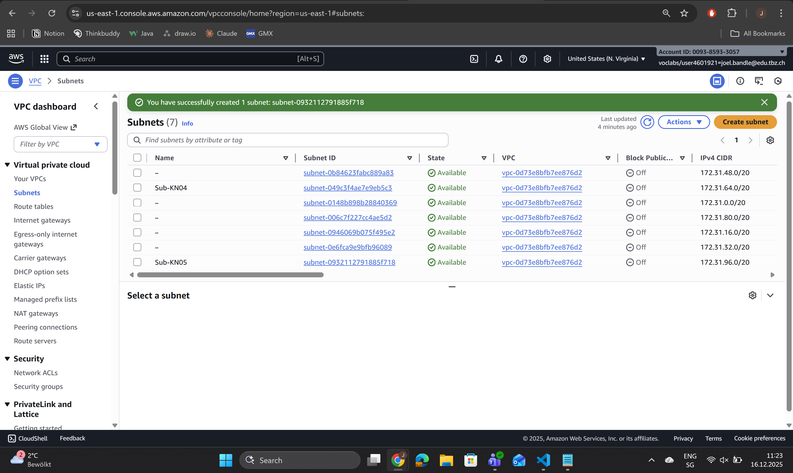
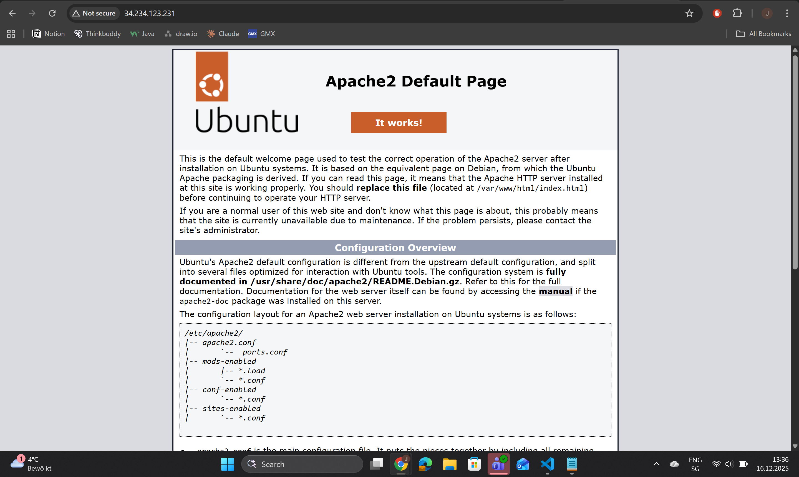
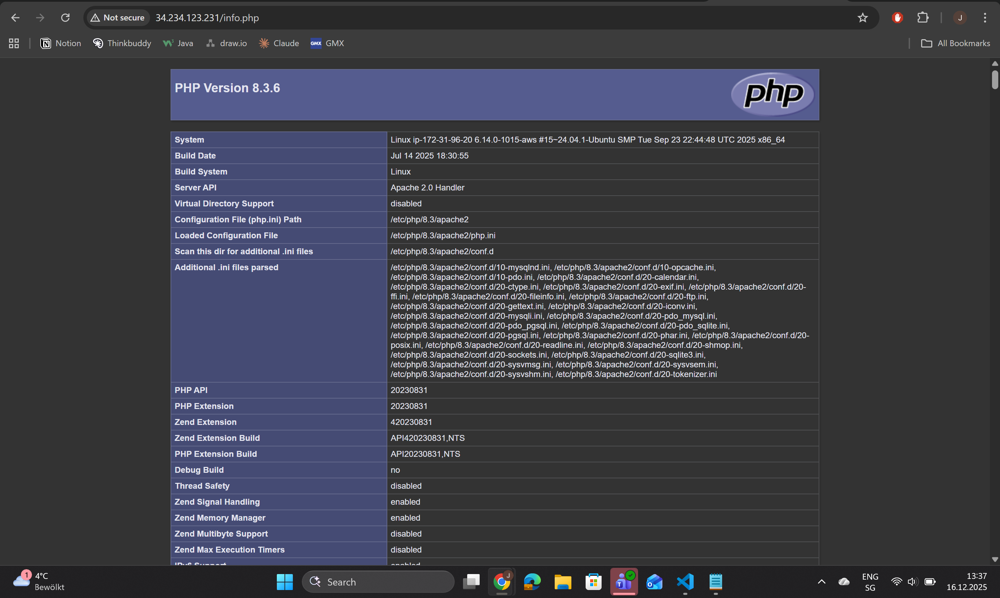
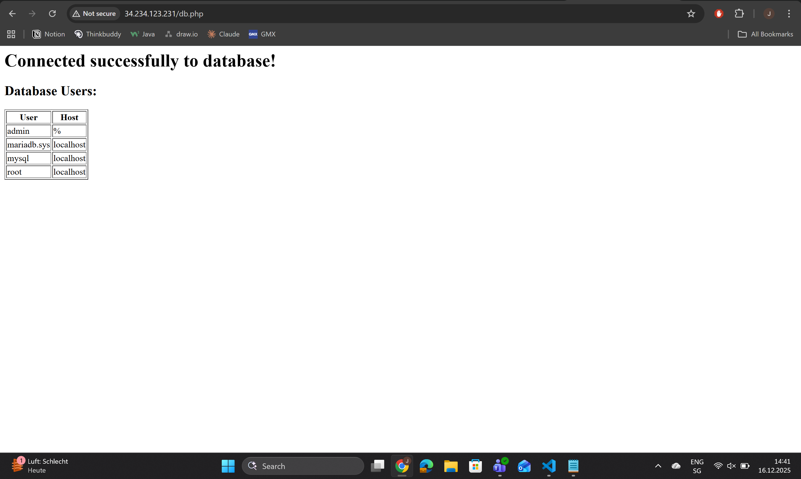
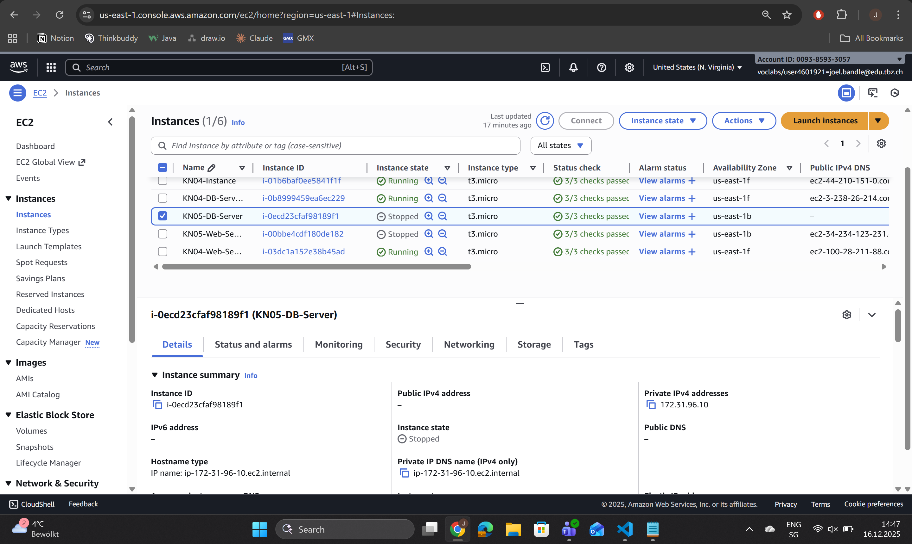
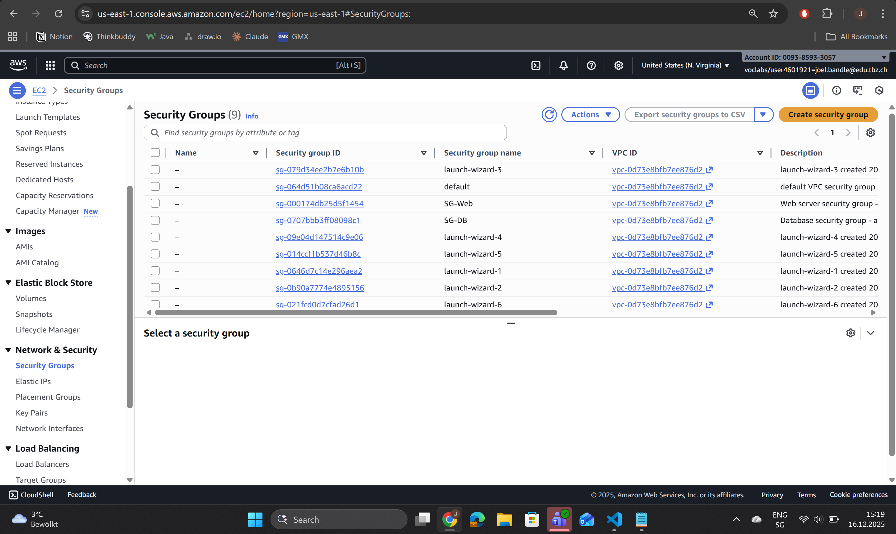
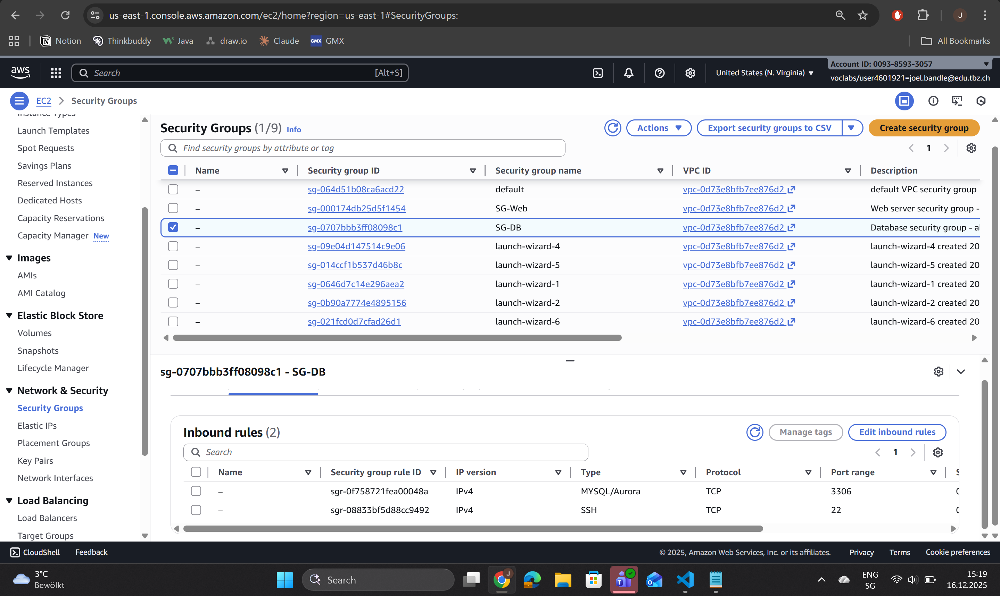
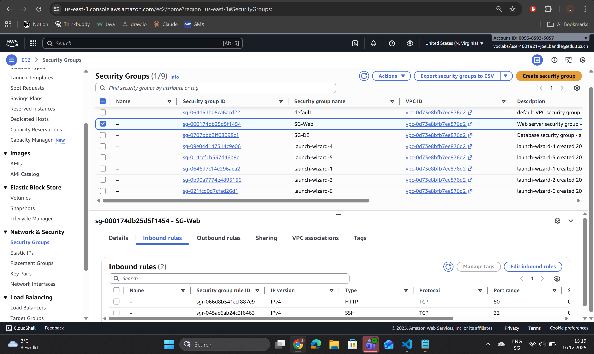

# KN05

## Aufgabe A

## Begriffserklärungen

### VPC (Virtual Private Cloud)
Ein isoliertes virtuelles Netzwerk in AWS. Alle Ressourcen (EC2-Instances, Datenbanken, etc.) innerhalb einer VPC können miteinander kommunizieren. Eine VPC hat einen definierten IP-Adressbereich (z.B. 172.31.0.0/16).

### Subnet (Subnetz)
Ein Teilbereich innerhalb einer VPC mit einem eigenen IP-Adressbereich. Subnets ermöglichen die Aufteilung des VPC-Netzwerks in kleinere Segmente (z.B. 172.31.96.0/20). Instances werden in Subnets gestartet.

### Public IP (Öffentliche IP)
Eine IP-Adresse, die vom Internet aus erreichbar ist. Diese IP wird beim Start einer Instance zugewiesen und ändert sich bei jedem Neustart (außer bei Elastic IPs).

### Private IP (Private IP)
Eine interne IP-Adresse, die nur innerhalb der VPC verwendet wird. Diese IP bleibt konstant und wird für die Kommunikation zwischen Instances innerhalb des Netzwerks verwendet.

### Static IP (Statische IP)
Eine IP-Adresse, die sich nicht ändert. Bei Private IPs sind diese automatisch statisch. Bei Public IPs kann eine Elastic IP zugewiesen werden, um eine statische öffentliche Adresse zu erhalten.

## Unterschied: Öffentliche vs. Private IP

**Öffentliche IP:**
- Von ausserhalb der VPC (Internet) erreichbar
- Ändert sich bei jedem Neustart (außer Elastic IP)
- Wird für externen Zugriff benötigt (z.B. SSH, HTTP)

**Private IP:**
- Nur innerhalb der VPC erreichbar
- Bleibt konstant, ändert sich nicht
- Wird für interne Kommunikation verwendet (z.B. Web-Server zu DB-Server)

## VPC und Subnets - Analyse

**Meine VPC:**
- VPC ID: vpc-0d73e8bfb7ee876d2
- IPv4 CIDR: 172.31.0.0/16
- Verfügbare IPs: 172.31.0.0 bis 172.31.255.255 (65.536 Adressen)

**Anzahl Subnets:** 7
- 6 Standard-Subnets (von AWS vordefiniert)
- 1 eigenes Subnet: Sub-KN04
- 1 neu erstelltes Subnet: Sub-KN05

**Decken die Subnets den gesamten VPC-Bereich ab?**
Nein, nicht alle IP-Bereiche sind durch Subnets abgedeckt. Es gibt noch freie Bereiche, z.B. wurde 172.31.96.0/20 für Sub-KN05 verwendet.

## Subnet für KN04-Instances

Die Instances aus KN04 (DB-Server und Web-Server) liegen im Subnet:
- **Name:** Sub-KN04
- **Subnet ID:** subnet-049c3f4ae7e9eb5c3
- **IPv4 CIDR:** 172.31.64.0/20

## Neues Subnet: Sub-KN05

**Konfiguration:**
- **Name:** Sub-KN05
- **Availability Zone:** us-east-1a
- **IPv4 CIDR:** 172.31.96.0/20
- **Verfügbare IPs:** 172.31.96.0 bis 172.31.111.255

## Definierte Private IPs für zukünftige Instances

Für die kommenden Aufgaben werden folgende Private IPs verwendet:

**DB-Server Private IP:**
```
172.31.96.10
```

**Web-Server Private IP:**
```
172.31.96.20
```



## Aufgabe B 








