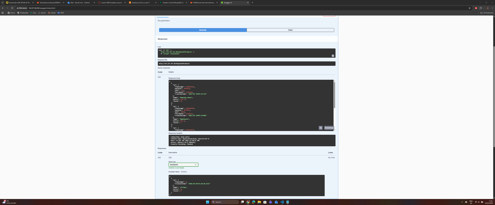
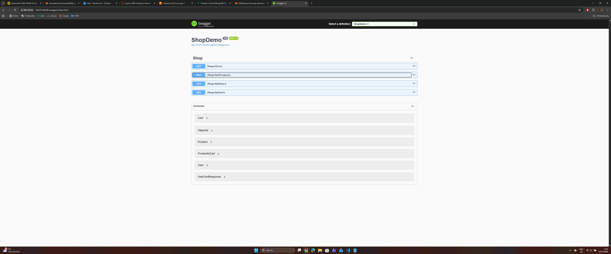
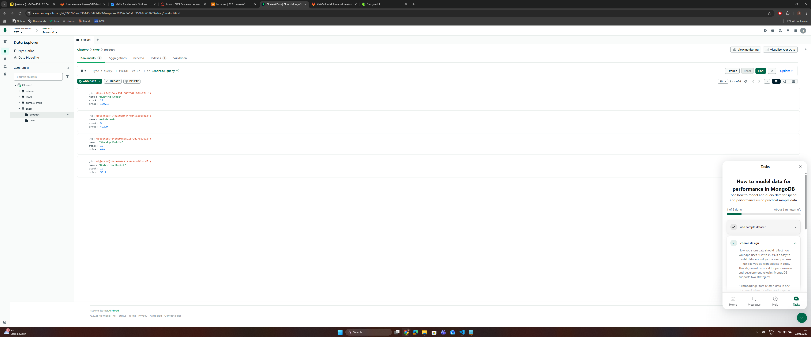
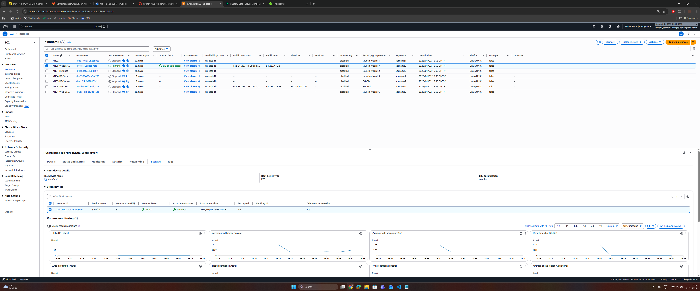
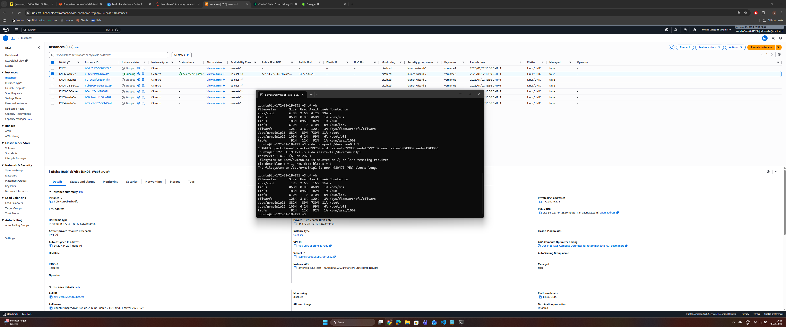
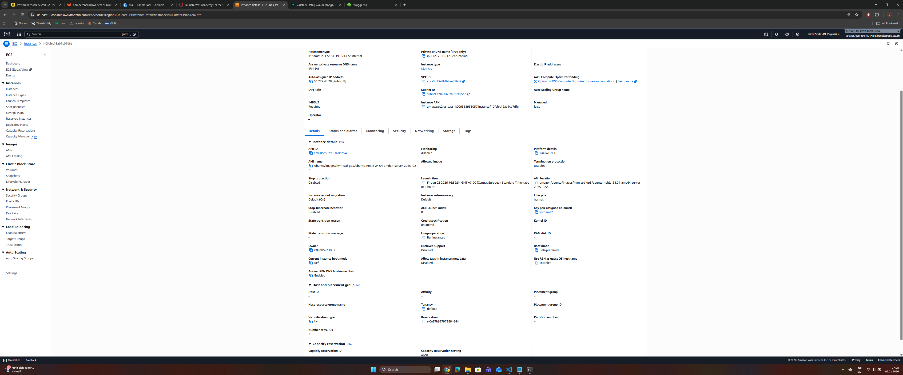
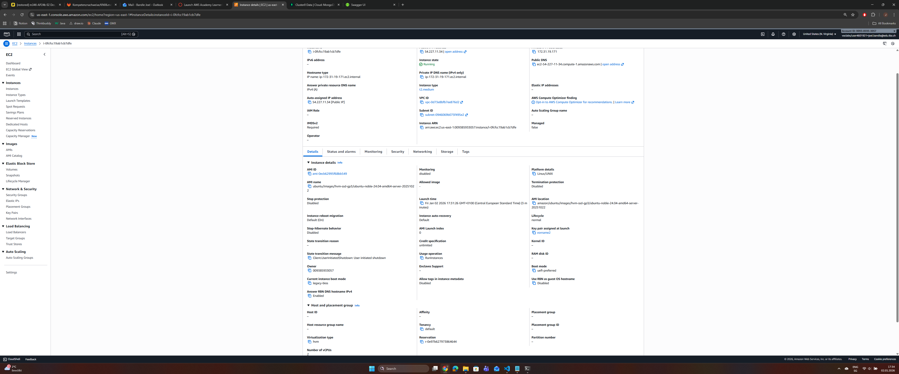

# KN06

## Aufgabe A

Ein Reverse Proxy ist ein Server, der vor einer Anwendung steht und als Vermittler fungiert. 

In diesem Fall:
- Die .NET App läuft auf Port 5000 (intern)
- Nginx läuft auf Port 80 (öffentlich)
- Nginx nimmt Anfragen auf Port 80 entgegen und leitet sie an Port 5000 weiter

Vorteile:
- Benutzer können die Standard-HTTP-Port 80 verwenden (nicht Port 5000)
- Nginx kann SSL/TLS, Load Balancing, Caching übernehmen
- Die App ist nicht direkt vom Internet erreichbar (Sicherheit)

Problematisch in Produktion:

1. ssh_pwauth: true
   - Erlaubt Passwort-Login per SSH
   - In Produktion sollte nur SSH-Key erlaubt sein!

2. disable_root: false  
   - Root-Login ist erlaubt
   - Sollte deaktiviert sein (Sicherheit!)

3. Passwörter im Klartext in Cloud-init
   - MongoDB-Passwort steht direkt im Script
   - Sollte über AWS Secrets Manager oder Parameter Store geladen werden

4. 0.0.0.0/0 in MongoDB Network Access
   - Alle IPs können auf MongoDB zugreifen
   - Sollte nur AWS IP-Ranges erlauben

5. Keine Backup-Strategie
6. Keine Monitoring/Logging-Konfiguration





## Aufgabe B

Was ist vertikale Skalierung?

- Mehr Ressourcen für eine einzelne Instance
- Größere Disk, mehr RAM, mehr CPUs
- "Mach den Server stärker"

### **Frage: Geht das im laufenden Betrieb?**

**Antwort:**
```
Ja die Disk-Erweiterung kann im laufenden Betrieb durchgeführt werden.

Schritte:
1. Volume Modify in AWS - ONLINE möglich
2. Partition erweitern (growpart) - ONLINE möglich
3. Dateisystem erweitern (resize2fs) - ONLINE möglich

Die Instance muss NICHT gestoppt werden
Die App läuft während der Erweiterung weiter.
```

### **Frage: Geht das im laufenden Betrieb?**

**Antwort:**
```
Nein, die Instance Type Änderung erfordert einen Stopp.

Schritte:
1. Instance muss gestoppt werden
2. Instance Type ändern (nur im Stopped-State möglich)
3. Instance wieder starten

Während des Stopps ist die App nicht verfügbar
```






## Aufgabe C

Was ist horizontale Skalierung?

- Mehr Instances (nicht stärkere)
- Mehrere Server arbeiten zusammen
- Load Balancer verteilt Traffic
- Mehr Server, nicht stärkere Server

Was ist eine Target Group?

- Eine Gruppe von Instances
- Load Balancer verteilt Traffic an alle Instances in der Target Group
- Health Checks prüfen ob Instances gesund sind

### Brauche Hilfe bei dieser Aufgabe

## Aufgabe D

### Aufgabe C muss zuerst funktionieren