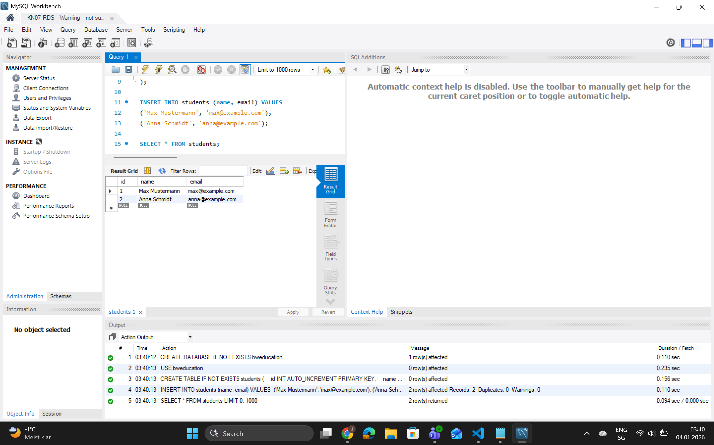
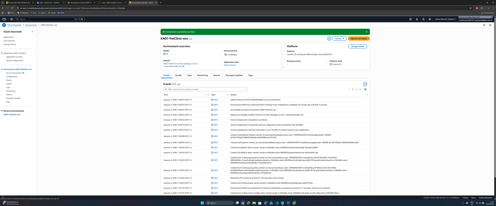
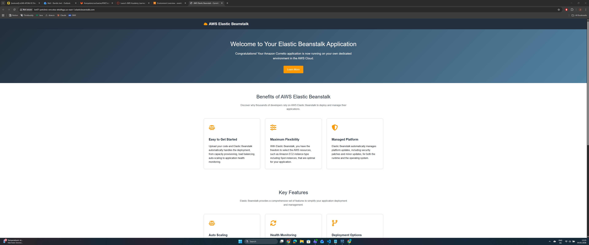
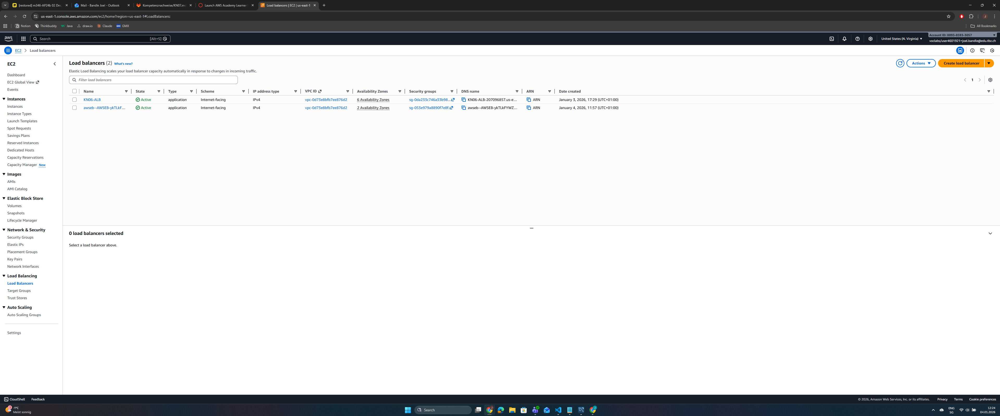
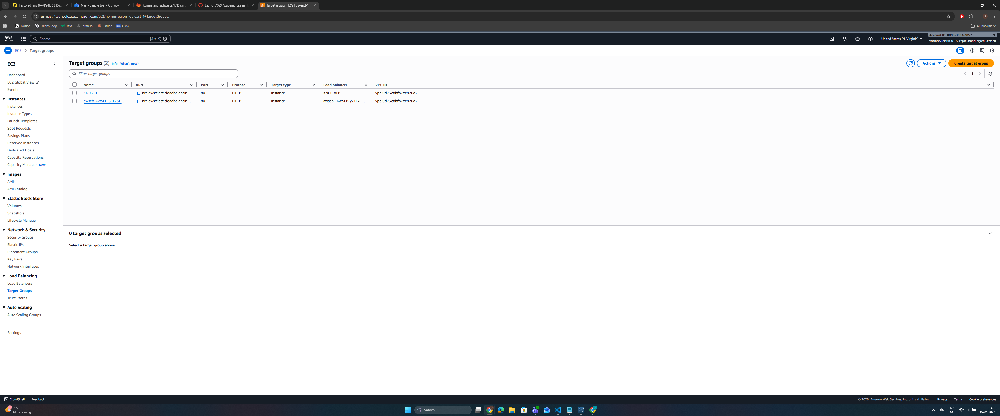
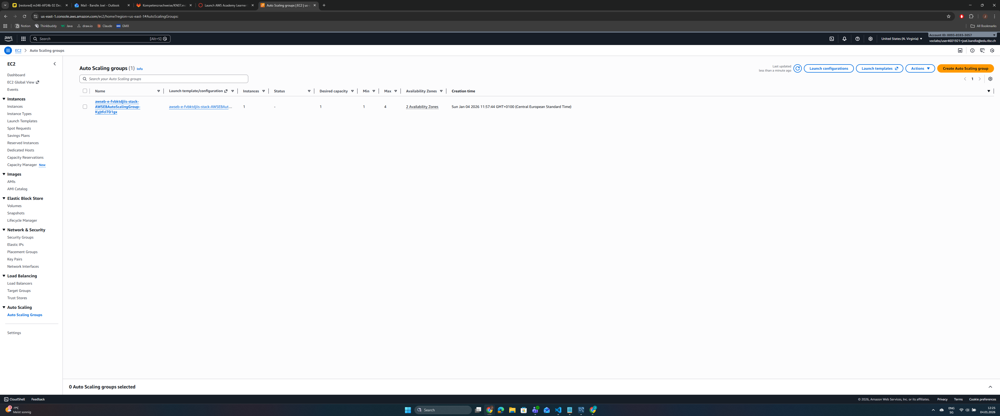
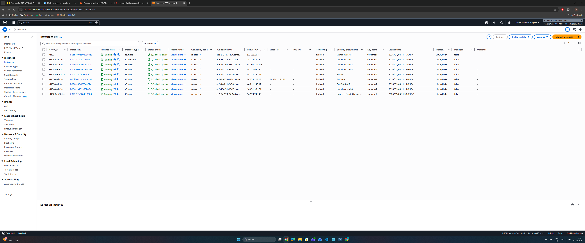
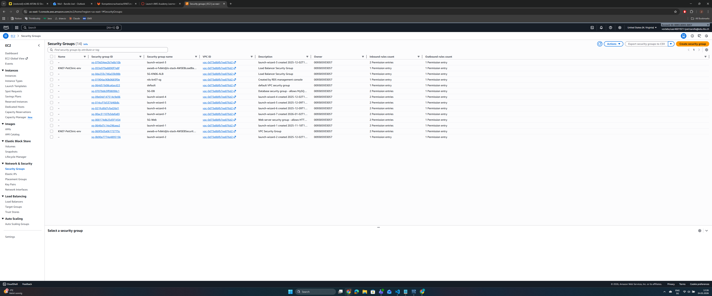
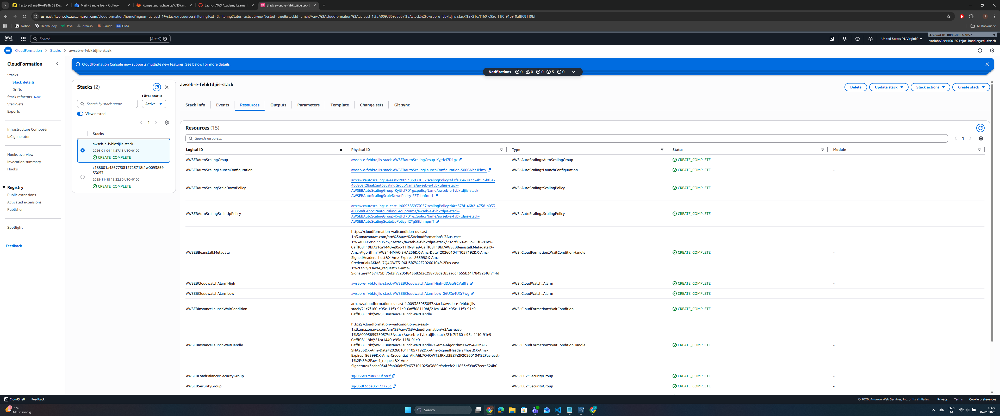

# KN07

## Aufgabe A

Was ist RDS?

- Relational Database Service
- AWS managed die Datenbank (Backups, Updates, Patches)
- Du musst keine EC2 Instance dafür starten
- PaaS statt IaaS

### Erklärung:

**Warum PaaS/SaaS statt eigene Datenbank?**

Vorteile von PaaS/SaaS Datenbank (RDS):

1. Wartung automatisiert:
   - AWS managed Backups, Updates, Security Patches
   - Keine manuelle Installation/Konfiguration nötig

2. Hochverfügbarkeit:
   - Multi-AZ Deployment möglich
   - Automatisches Failover
   - 99.95% Uptime SLA

3. Skalierung einfach:
   - Vertical Scaling mit wenigen Klicks
   - Read Replicas für horizontale Skalierung
   - Storage auto-scaling

4. Backup & Recovery:
   - Automatische Backups
   - Point-in-time Recovery
   - Snapshots

5. Sicherheit:
   - Encryption at rest/in transit
   - Security Groups
   - IAM integration

6. Kosteneffizienz:
   - Pay-as-you-go
   - Keine eigene Hardware
   - Kein Admin-Personal nötig

Nachteile eigene Datenbank (IaaS):
   - Manuelles Patching
   - Eigenes Backup-Management
   - Mehr Aufwand für HA
   - Mehr Verantwortung

## Aufgabe B/C

Was ist Elastic Beanstalk?

- PaaS (Platform as a Service)
- Du lädst nur deine App hoch
- AWS managed alles (EC2, Load Balancer, Auto Scaling, Monitoring)
- Wie Heroku, aber von AWS

## Erklärung:

CloudFormation ist ein Infrastructure-as-Code (IaC) Service von AWS.

Es beschreibt alle AWS-Ressourcen als Code (YAML/JSON) und erstellt/verwaltet sie automatisch.

Unterschied zu Cloud-init:

Cloud-init:
- Konfiguriert eine EINZELNE EC2 Instance
- Läuft NACH dem Start der Instance
- Bash-Befehle, Pakete installieren
- Nur für das Betriebssystem/Software
- Instance-Level

CloudFormation:
- Erstellt KOMPLETTE Infrastruktur (EC2, LB, ASG, etc.)
- Läuft VOR dem Start (erstellt die Resources)
- Deklarativ (YAML/JSON Templates)
- Für alle AWS-Services
- Account/Region-Level

Beispiel:
- Cloud-init: "Installiere Apache auf dieser EC2"
- CloudFormation: "Erstelle 2 EC2s, 1 Load Balancer, 1 RDS, 3 Security Groups"

Elastic Beanstalk NUTZT CloudFormation im Hintergrund

## Unterschiede:

KN06 (IaaS - manuell):
- Du hast ALLES manuell erstellt:
    - EC2 Instances gestartet
    - Security Groups konfiguriert
    - Load Balancer erstellt
    - Target Groups erstellt
    - Auto Scaling konfiguriert
    - Cloud-init geschrieben

KN07 (PaaS - automatisch):
- Elastic Beanstalk hat ALLES automatisch erstellt:
    - EC2 Instances
    - Security Groups
    - Load Balancer
    - Target Groups
    - Auto Scaling
    - CloudWatch Monitoring

Vorteil PaaS:
- Viel schneller!
- Weniger Fehler
- Best Practices automatisch
- Managed Updates
- Einfacher zu skalieren

Nachteil PaaS:
- Weniger Kontrolle
- Kann teurer sein
- Vendor Lock-in

## Aufgabe C (Erklärungen)

CloudFormation ist ein Infrastructure-as-Code Service.
- Beschreibt Infrastruktur als Code (YAML/JSON)
- Erstellt und managed AWS-Ressourcen automatisch
- Versionierung möglich
- Wiederholbar und konsistent

Cloud-init:
- Konfiguriert EINE EC2 Instance
- Läuft NACH dem Instance-Start
- Bash-Befehle für OS/Software
- Instance-Level

CloudFormation:
- Erstellt KOMPLETTE Infrastruktur
- Läuft VOR dem Start (erstellt Resources)
- Deklarative Templates
- Account/Region-Level

KN06 (IaaS):
- Alles manuell erstellt
- Cloud-init für Config
- Mehr Kontrolle, mehr Arbeit

KN07 (PaaS):
- Elastic Beanstalk erstellt alles automatisch
- CloudFormation im Hintergrund
- Weniger Kontrolle, weniger Arbeit
- Managed Updates & Monitoring