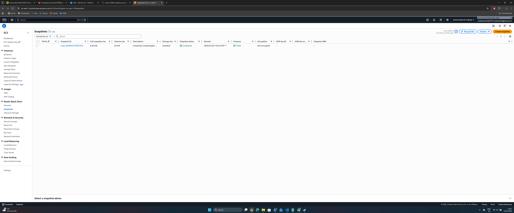
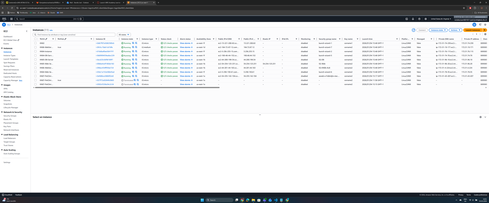
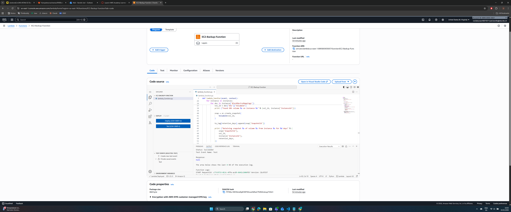
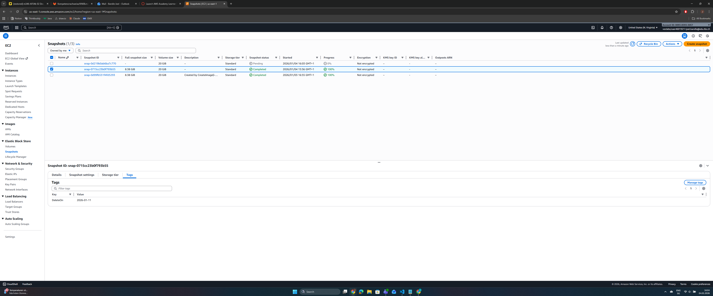
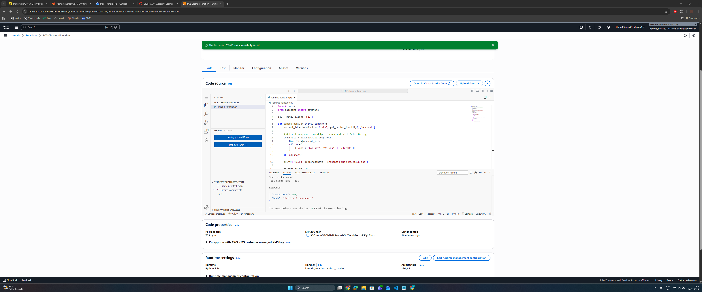
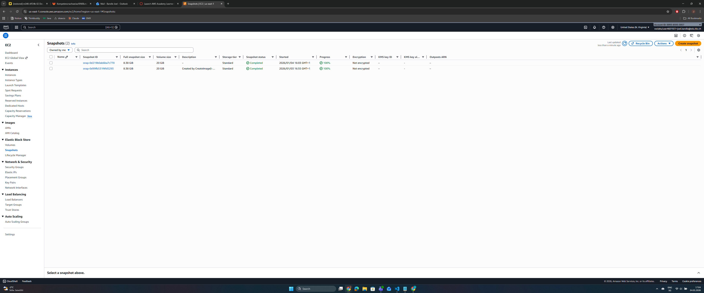
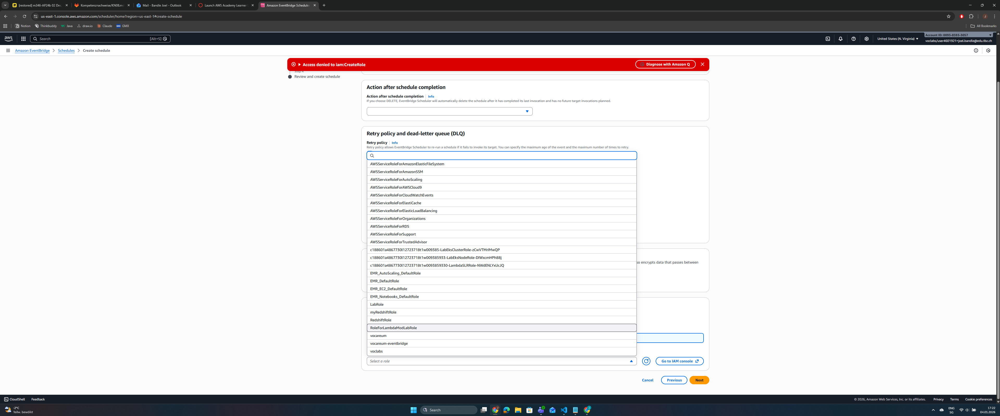
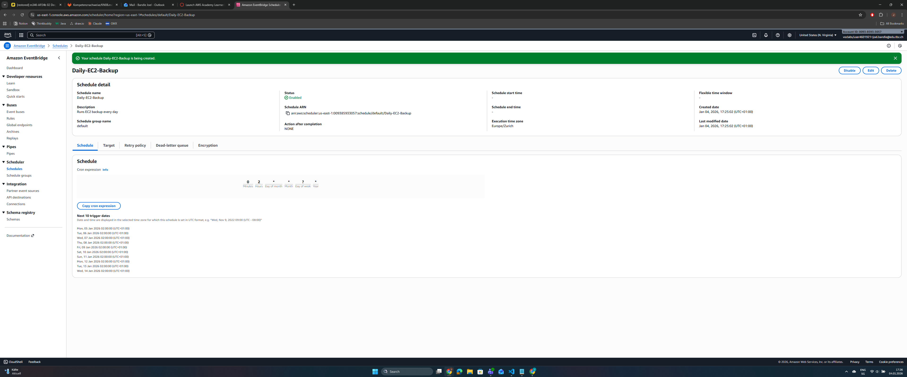

# KN08

## Aufgabe A

Was ist AWS Lambda?

- FaaS (Function as a Service) / Serverless
- Du schreibst nur Code, kein Server nötig
- Läuft nur wenn getriggert (Event-driven)
- Bezahlst nur für Ausführungszeit
- Python, Node.js, Java, etc.

## Aufgabe B

