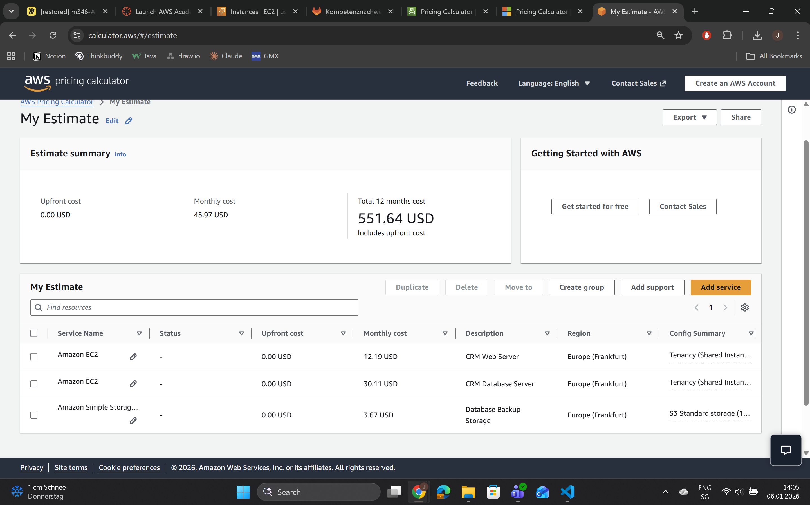
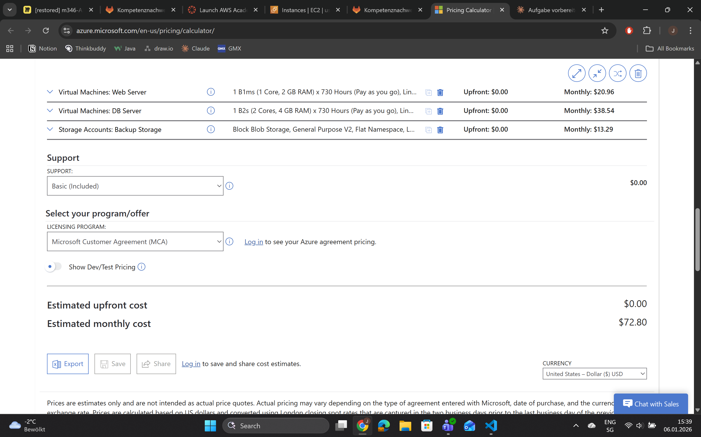
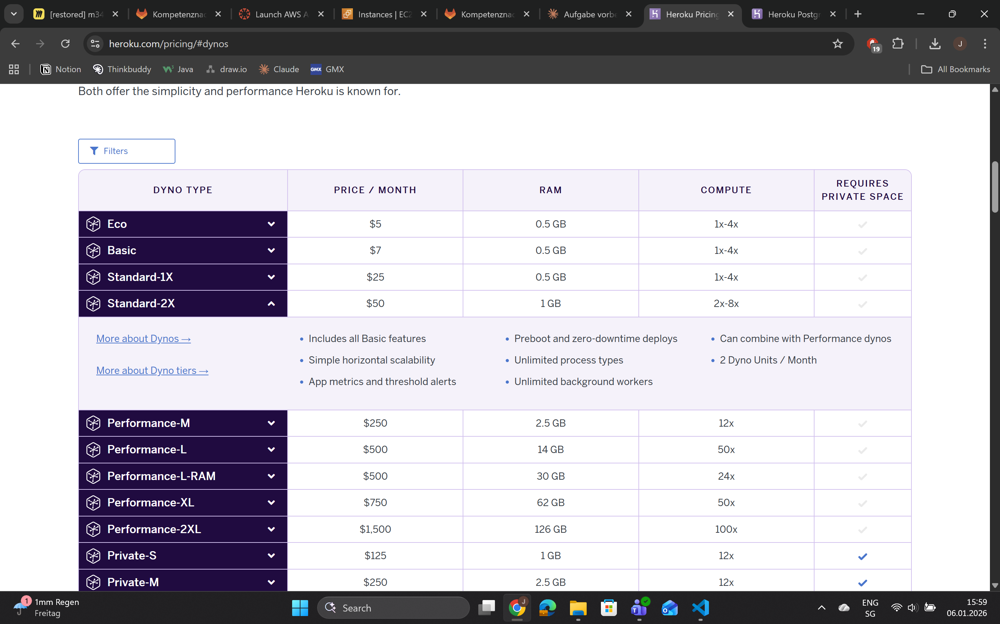
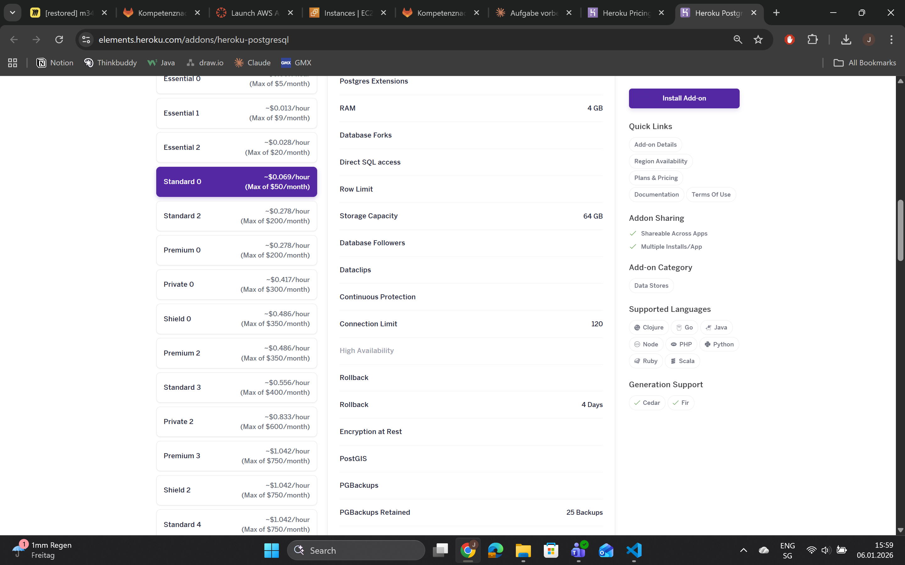
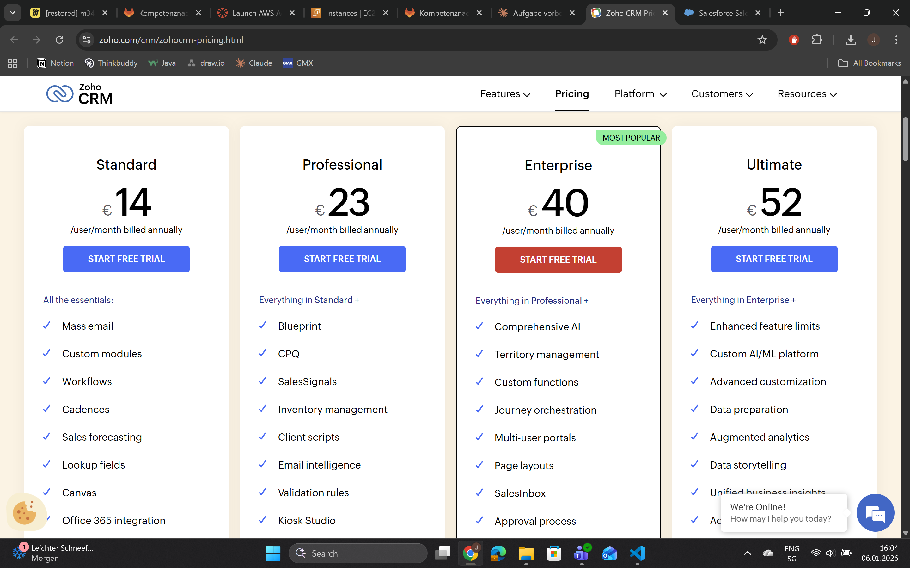
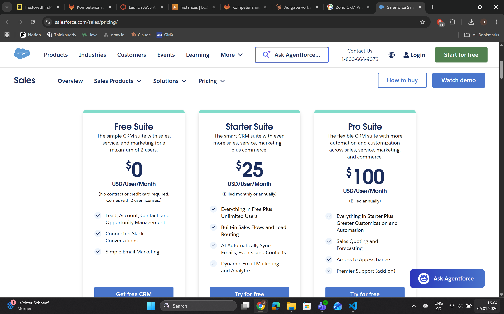

# KN10

## Aufgabe A

Was ist Rehosting?

- "Lift and Shift"
- VMs 1:1 in die Cloud verschieben
- Gleiche Software, gleiche Architektur
- Nur die Hardware wird Cloud

## Aufgabe B

Standard-2X Dyno (Web App):  $50/Monat
Standard 0 Postgres (DB):     $50/Monat
Backups:                      $0 (inkludiert)

Total:                        $100/Monat
                              $1200/Jahr

## Aufgabe C

Was ist Repurchasing?
- Eigene Software ERSETZEN
- Fertige SaaS-Lösung kaufen (CRM)
- KEINE Infrastruktur mehr nötig!
- Nur noch Software-Lizenz bezahlen

Zoho CRM Professional:
- $690/Monat = $8,280/Jahr
- Gute Features für den Preis
- Ausreichend für 30 User

Salesforce Professional:
- $2,400/Monat = $28,800/Jahr
- Beste Features, Industrie-Standard
- 3.5× teurer als Zoho

## Aufgabe D

## 1. KOSTENVERGLEICH

### Reine Infrastruktur-/Software-Kosten

- AWS (IaaS):          $845/Jahr
- Azure (IaaS):        $874/Jahr
- Heroku (PaaS):       $1,200/Jahr
- Zoho (SaaS):         $8,280/Jahr
- Salesforce (SaaS):   $28,800/Jahr

Auf den ersten Blick scheint IaaS am günstigsten. ABER: Versteckte Kosten!

### Reale Gesamtkosten (inkl. Personal)

**AWS/Azure (IaaS): ~$42,000/Jahr**
- DevOps Personal: $40,000/Jahr (0.5 FTE)
- OS-Updates, Patches, Backups, Monitoring
- Support, Tools, Downtime-Risiko

**Heroku (PaaS): ~$9,200/Jahr**
- Developer: $8,000/Jahr (0.1 FTE)
- Nur Deployments und Monitoring

**Zoho (SaaS): ~$12,300/Jahr**
- Business Analyst: $4,000/Jahr (0.05 FTE)
- Nur User-Management und Workflows

**Salesforce (SaaS): ~$32,800/Jahr**
- Business Analyst: $4,000/Jahr (0.05 FTE)

**FAZIT:** IaaS ist am TEUERSTEN durch Personal-Kosten!
PaaS/SaaS sparen $30,000-35,000/Jahr!

### Warum sind die Kosten unterschiedlich?

**IaaS:** Volle Kontrolle = Volle Verantwortung
- Personal-Kosten überwiegen Infrastruktur

**PaaS:** Managed Infrastructure
- $30/Monat Mehrkosten, aber $32k weniger Personal

**SaaS:** Komplettlösung
- Höchste Software-Kosten, niedrigste Gesamt-Kosten

**Zoho vs Salesforce:**
- $20,500/Jahr Unterschied
- Für 30 User NICHT gerechtfertigt
- Zoho hat alle benötigten Features

### Sind die Unterschiede gerechtfertigt?

- **IaaS:** NEIN (zu teuer für 30 User)
- **PaaS:** JA (gutes Preis-/Leistungsverhältnis)
- **Zoho:** JA (beste Kosten-/Nutzen)
- **Salesforce:** NEIN (überdimensioniert)

---

## 2. AUFWANDSVERGLEICH

### Migration (einmalig)

| Variante | Dauer | Kosten | Anforderungen |
|----------|-------|--------|---------------|
| IaaS | 2-3 Monate | $25,000 | DevOps Engineer |
| PaaS | 1-2 Monate | $10,000 | Developer |
| SaaS | 2-4 Wochen | $8,000 | Keine IT-Skills |

### Laufender Betrieb (monatlich)

**IaaS: 80-100 Std/Monat, DevOps Vollzeit**
- OS-Updates, Security Patches
- Backup-Management
- Performance-Monitoring
- Troubleshooting
- On-Call Bereitschaft

**PaaS: 10-20 Std/Monat, Developer Teilzeit**
- Deployments
- Monitoring

**SaaS: 5-10 Std/Monat, Business User**
- User-Management
- Workflows anpassen
- Reports erstellen

**FAZIT:** SaaS hat niedrigsten Aufwand! IaaS bindet permanent IT-Personal.

---

## 3. EMPFEHLUNG

### 1. WAHL: ZOHO CRM (SaaS)

#### Begründung

**Vorteile:**
- Beste Gesamtkosten: $12,300/Jahr (inkl. Personal)
- Schnellste Implementierung: 2-4 Wochen
- Niedrigster laufender Aufwand: 5-10 Std/Monat
- Kein IT-Personal nötig
- Moderne CRM-Features (Mobile, Automation, Analytics)
- Automatische Updates und Backups
- Support inkludiert
- Skalierbar
- ROI bereits nach 3-4 Monaten vs IaaS

**Risiken:**
- Vendor Lock-in
- Weniger Customization als eigene Software
- Internet-Abhängigkeit

**Mitigation:**
- Regelmäßige Daten-Exports (CSV)
- API für kritische Integrationen
- SLA mit 99.9% Uptime

### 2. WAHL: HEROKU (PaaS)

**Falls eigene Software behalten werden muss**

**Vorteile:**
- Gute Gesamtkosten: $9,200/Jahr
- Eigene Software bleibt
- Managed Infrastructure
- Weniger Vendor Lock-in
- Developer-freundlich

**Wann wählen:**
- Spezielle Features die keine SaaS bietet
- Bestehendes Entwickler-Team vorhanden
- Compliance-Gründe (Daten-Kontrolle)

### NICHT EMPFOHLEN

**IaaS (AWS/Azure):**
- Zu hohe Gesamtkosten: ~$42,000/Jahr
- Bindet permanent IT-Personal
- Komplexe Verwaltung
- Nur für Firmen mit existierender IT-Abteilung sinnvoll

**Salesforce:**
- 2.7x teurer als Zoho
- Features überdimensioniert für 30 User
- $20,000/Jahr Mehrkosten nicht gerechtfertigt
- Nur für große Firmen (200+ User) geeignet

---

## FAZIT

Die versteckten Personal-Kosten machen den größten Unterschied.
Was auf den ersten Blick günstig aussieht (IaaS $850/Jahr) kostet real $42,000/Jahr!

Für kleine Firmen mit 30 Benutzern ist SaaS (Zoho) die beste Wahl:
- Niedrigste Gesamtkosten
- Geringster Aufwand
- Schnellste Implementierung
- Moderne Features
- Fokus auf Kerngeschäft statt IT-Verwaltung

Die Investition in SaaS zahlt sich durch gesparte Personal-Kosten, höhere Produktivität und Skalierbarkeit aus.